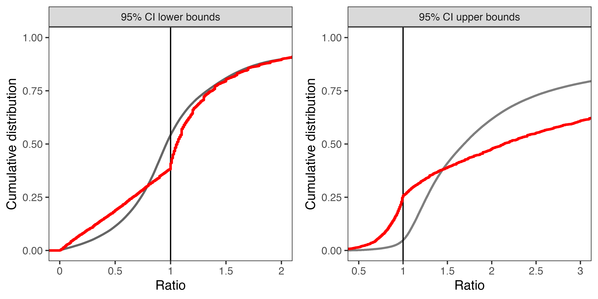
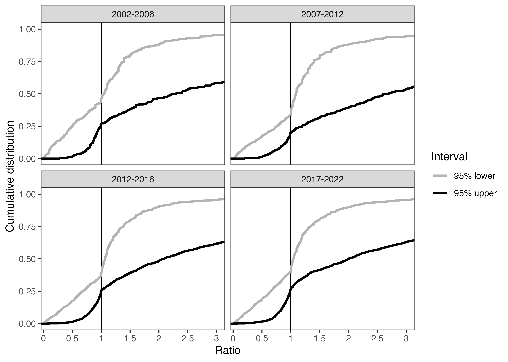
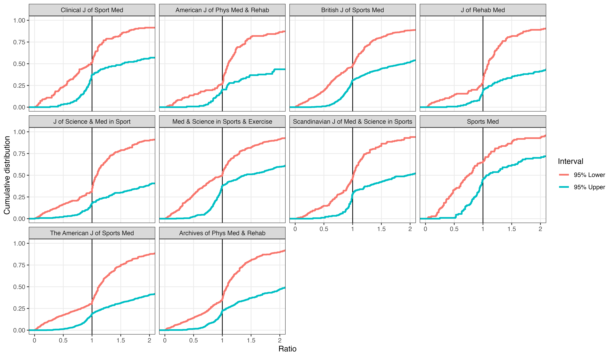
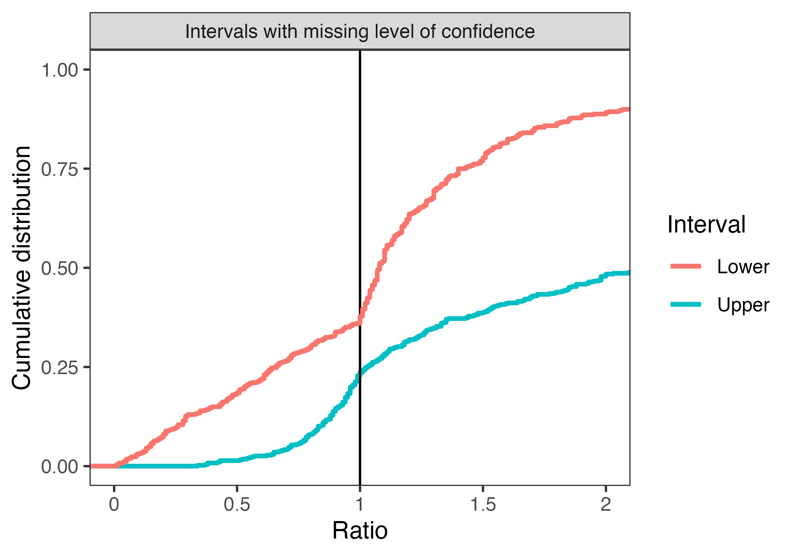

```{r setup, include=FALSE}
knitr::opts_chunk$set(warning = FALSE, echo = FALSE,
                      messages = FALSE,
                      fig.height = 8,
                      fig.width = 8)
source("load_packages.R")
source("3-main-analysis.R")
source("4-table2.R")
source("5-figure3-supplement2.R")
source("6-missing-data.R")
source("7-validation-checks.R")
```

# Main Analysis

## Summary of Articles Searched

```{r}
length(unique(d_papers$pubmed)) # checks
```

## Articles by journal

```{r}
with(d_papers, table(journal)) %>%
  as.data.frame() %>%
  rename(Journal = journal,
         Frequency = Freq) %>%
  knitr::kable()
```

\newpage

## Articles by journal and year

```{r, fig.width=8, fig.height=9}
with(d_papers, table(journal, year)) %>%
  as.data.frame() %>%
  ggplot(aes(y=Freq,x=year,color=journal,group=journal)) +
  geom_line()+
  facet_wrap(~journal, ncol = 3) +
  theme_bw() +
  labs(x = "", y = "") +
  theme(legend.position = "none",
        axis.text.x = element_text(angle = 90, vjust = 0.5, hjust=1))
```

\newpage

## Summary of ratio interval papers

```{r}
data %>% group_by(journal) %>%
  count() %>%
  mutate(pc = (n/nrow(data)*100),
         pc = round(pc,1)) %>%
  knitr::kable()
```

## Mistakes

```{r}
tabular(Heading('Mistake')*factor(mistake) + 1~ Heading('')*factor(source)*((n=1) + Percent('col')), data=data) 

```

## CI bound below Zero

```{r}
data %>% filter(lower<0) %>%
  count() %>%
  mutate(pc = (n/nrow(data))*100) %>% knitr::kable()
```

## Missing CI level

```{r}
to.table = filter(data, mistake==FALSE, lower>0) %>%
  mutate(is_95_missing = is.na(ci_level))
tabular(Heading('Missing')*factor(is_95_missing) + 1~ Heading('')*(factor(source) +1)*((n=1) + Percent('col')), data=to.table)

```

## Figure 1

Lower confidence interval (log-scale) split by CI type -, and upper confidence interval (log-scale)



## Figure 2


## Figure 3 



## Figure 4


\newpage

# Table 2

```{r}
gt_tab2
```


# Supplements

## Supplement 1


## Supplement 2 



## Supplement 3


