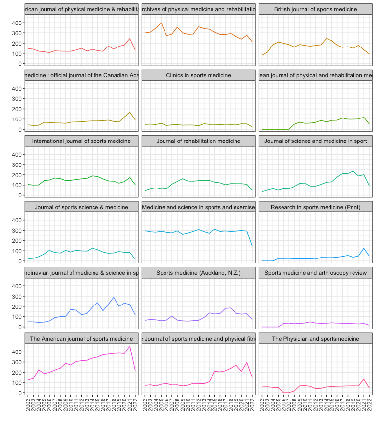
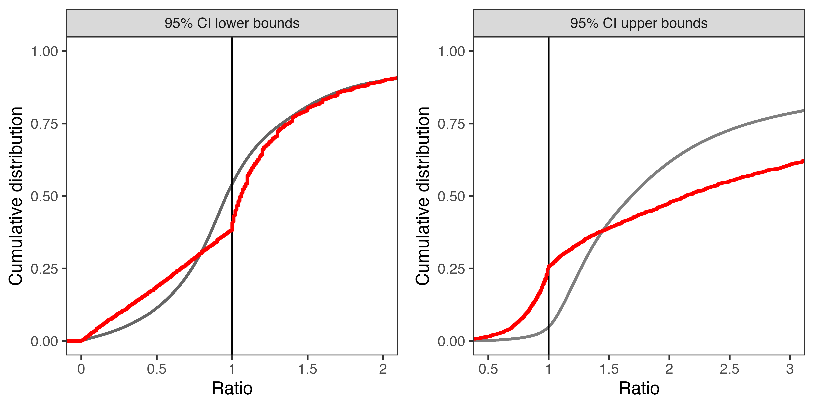
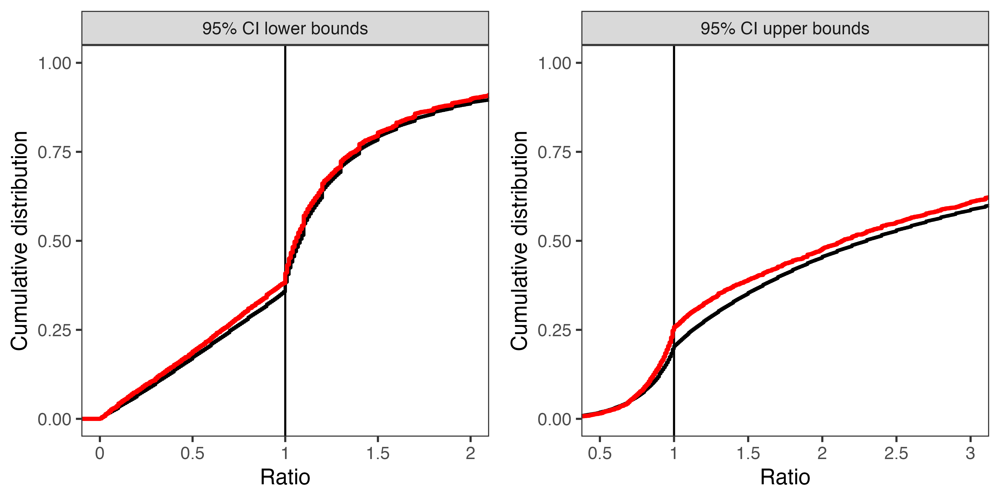
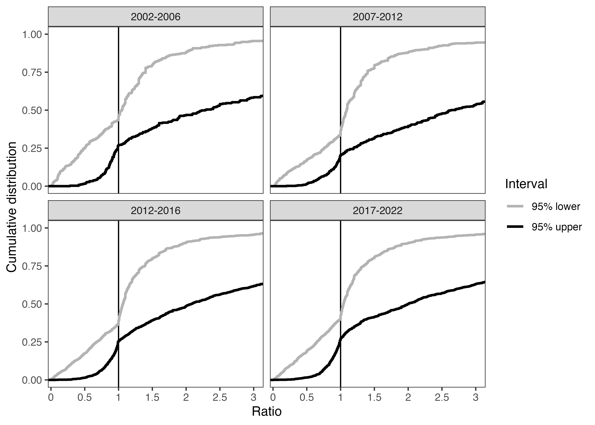
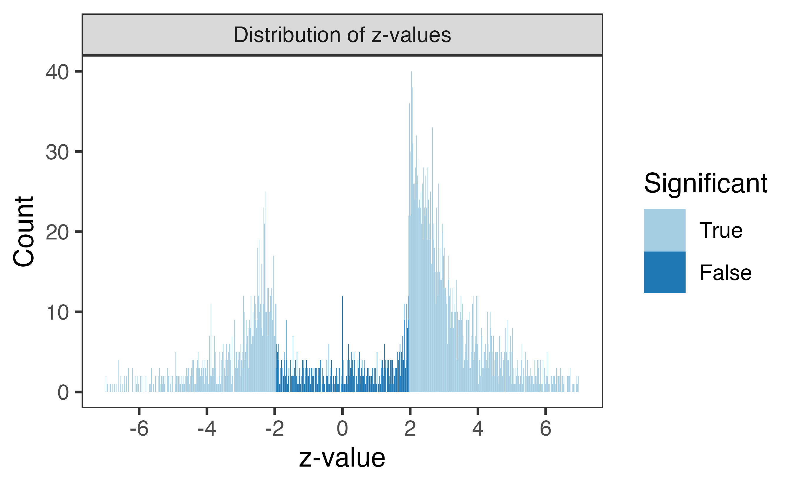
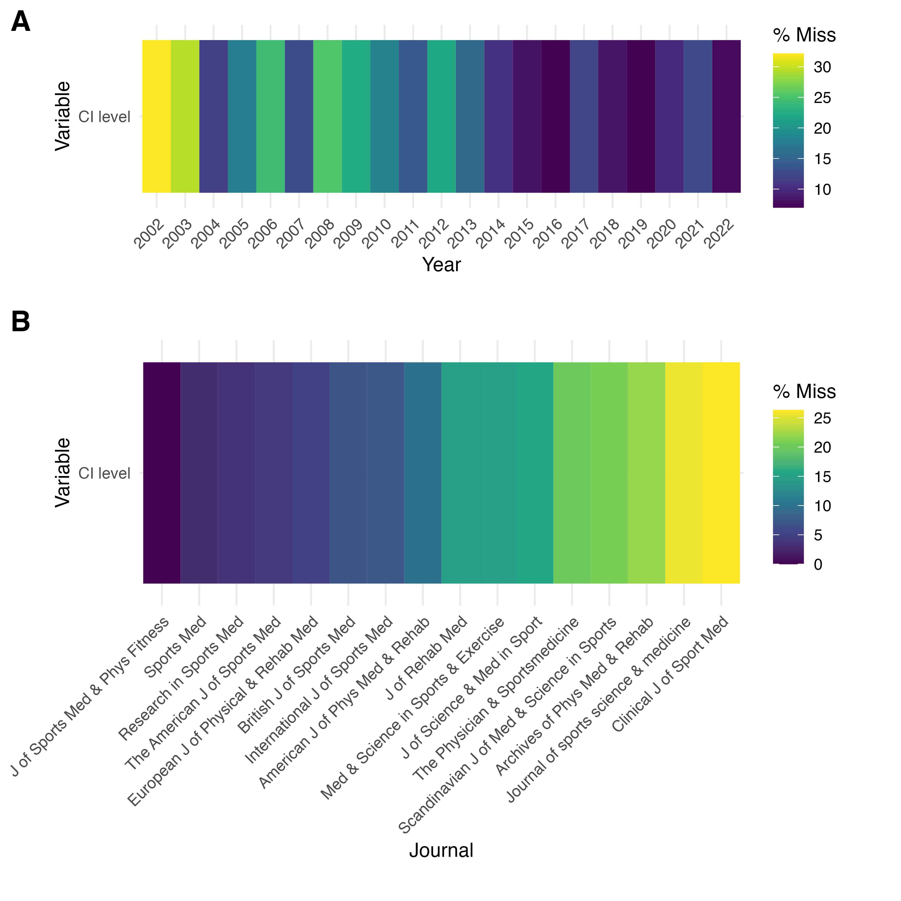
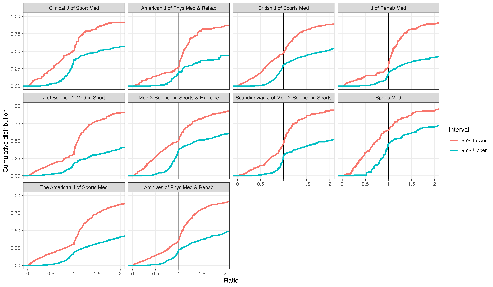
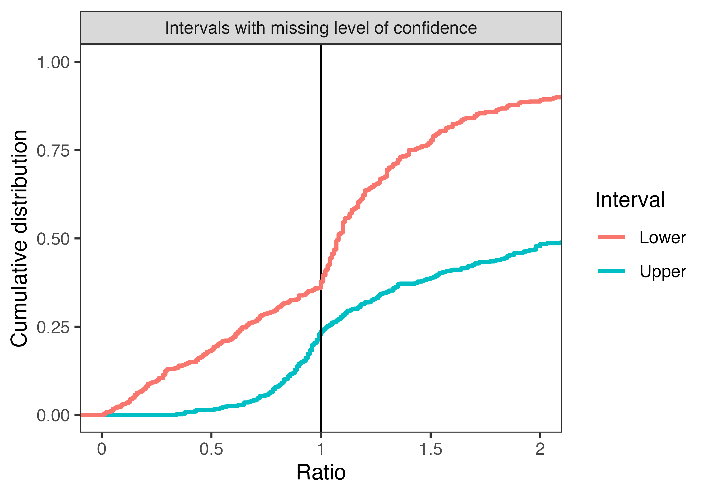

Sports Medicine Confidence Intervals
================
2022-06-10

# Main Analysis

## Summary of Articles Searched

    ## [1] 48390

## Articles by journal

| Journal                                                                                         | Frequency |
|:------------------------------------------------------------------------------------------------|----------:|
| American journal of physical medicine & rehabilitation                                          |      2938 |
| Archives of physical medicine and rehabilitation                                                |      6335 |
| British journal of sports medicine                                                              |      3554 |
| Clinical journal of sport medicine : official journal of the Canadian Academy of Sport Medicine |      1606 |
| Clinics in sports medicine                                                                      |       954 |
| European journal of physical and rehabilitation medicine                                        |      1222 |
| International journal of sports medicine                                                        |      3034 |
| Journal of rehabilitation medicine                                                              |      2255 |
| Journal of science and medicine in sport                                                        |      2501 |
| Journal of sports science & medicine                                                            |      1677 |
| Medicine and science in sports and exercise                                                     |      5945 |
| Research in sports medicine (Print)                                                             |       677 |
| Scandinavian journal of medicine & science in sports                                            |      2987 |
| Sports medicine (Auckland, N.Z.)                                                                |      2048 |
| Sports medicine and arthroscopy review                                                          |       588 |
| The American journal of sports medicine                                                         |      6088 |
| The Journal of sports medicine and physical fitness                                             |      2847 |
| The Physician and sportsmedicine                                                                |      1134 |

## Articles by journal and year

<!-- -->

## Summary of ratio interval papers

| journal                                                                                         |    n |   pc |
|:------------------------------------------------------------------------------------------------|-----:|-----:|
| American journal of physical medicine & rehabilitation                                          |  153 |  3.4 |
| Archives of physical medicine and rehabilitation                                                |  690 | 15.4 |
| British journal of sports medicine                                                              |  660 | 14.7 |
| Clinical journal of sport medicine : official journal of the Canadian Academy of Sport Medicine |  228 |  5.1 |
| European journal of physical and rehabilitation medicine                                        |   40 |  0.9 |
| International journal of sports medicine                                                        |   84 |  1.9 |
| Journal of rehabilitation medicine                                                              |  184 |  4.1 |
| Journal of science and medicine in sport                                                        |  345 |  7.7 |
| Journal of sports science & medicine                                                            |   39 |  0.9 |
| Medicine and science in sports and exercise                                                     |  464 | 10.3 |
| Research in sports medicine (Print)                                                             |   27 |  0.6 |
| Scandinavian journal of medicine & science in sports                                            |  235 |  5.2 |
| Sports medicine (Auckland, N.Z.)                                                                |  123 |  2.7 |
| The American journal of sports medicine                                                         | 1048 | 23.4 |
| The Journal of sports medicine and physical fitness                                             |   90 |  2.0 |
| The Physician and sportsmedicine                                                                |   74 |  1.7 |

## Mistakes

    ##                          
    ##          abstract        
    ##  Mistake n        Percent
    ##  FALSE   4380      97.681
    ##  TRUE     104       2.319
    ##  All     4484     100.000

## CI bound below Zero

|   n |        pc |
|----:|----------:|
|  11 | 0.2453167 |

## Missing CI level

    ##                                       
    ##                                       
    ##          abstract         All         
    ##  Missing n        Percent n    Percent
    ##  FALSE   3858      88.36  3858  88.36 
    ##  TRUE     508      11.64   508  11.64 
    ##  All     4366     100.00  4366 100.00

## Figure 1

Lower confidence interval (log-scale) split by CI type -, and upper
confidence interval (log-scale)

## Figure 2

 \## Figure 3

## Figure 4

# Table 2

<table class="gt_table">
  <caption><strong>Table 2. CI characteristics</strong></caption>
  
  <thead class="gt_col_headings">
    <tr>
      <th class="gt_col_heading gt_columns_bottom_border gt_left" rowspan="1" colspan="1"><strong>Characteristic</strong></th>
      <th class="gt_col_heading gt_columns_bottom_border gt_center" rowspan="1" colspan="1"><strong>Current Study</strong>, N = 3,8191</th>
      <th class="gt_col_heading gt_columns_bottom_border gt_center" rowspan="1" colspan="1"><strong>Barnett &amp; Wren</strong>, N = 968,2891</th>
      <th class="gt_col_heading gt_columns_bottom_border gt_center" rowspan="1" colspan="1"><strong>Unbiased</strong>, N = 279,8761</th>
    </tr>
  </thead>
  <tbody class="gt_table_body">
    <tr><td class="gt_row gt_left">Lower interval between 1 and 1.1</td>
<td class="gt_row gt_center">620 (16%)</td>
<td class="gt_row gt_center">162,752 (17%)</td>
<td class="gt_row gt_center">24,314 (8.8%)</td></tr>
    <tr><td class="gt_row gt_left">Lower intervals between 1 and 1.2</td>
<td class="gt_row gt_center">966 (25%)</td>
<td class="gt_row gt_center">255,516 (26%)</td>
<td class="gt_row gt_center">41,817 (15%)</td></tr>
    <tr><td class="gt_row gt_left">Upper interval between 0.9 and 1</td>
<td class="gt_row gt_center">380 (10.0%)</td>
<td class="gt_row gt_center">68,625 (7.1%)</td>
<td class="gt_row gt_center">7,044 (2.5%)</td></tr>
    <tr><td class="gt_row gt_left">Upper intervals between 0.8 and 1</td>
<td class="gt_row gt_center">612 (16%)</td>
<td class="gt_row gt_center">113,883 (12%)</td>
<td class="gt_row gt_center">9,823 (3.6%)</td></tr>
  </tbody>
  
  <tfoot class="gt_footnotes">
    <tr>
      <td class="gt_footnote" colspan="4">1 n (%)</td>
    </tr>
  </tfoot>
</table>

# Supplements

## Supplement 1

## Supplement 2

## Supplement 3

